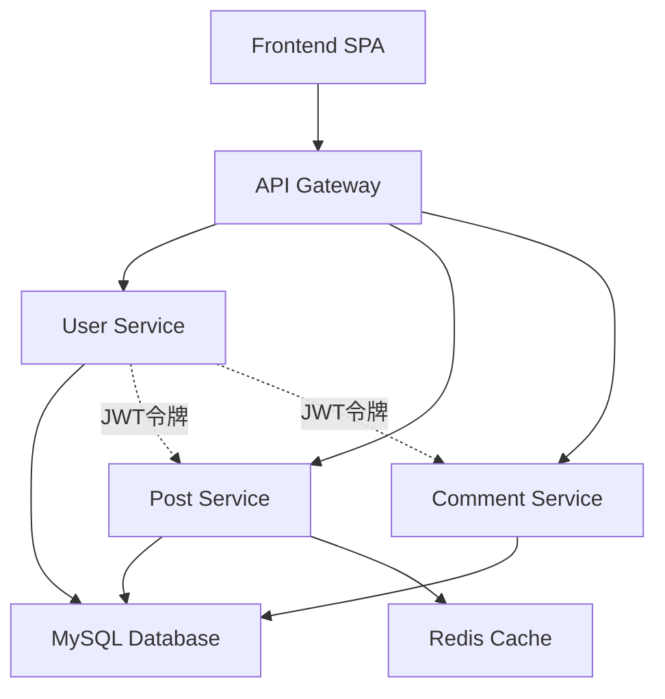

# 微服务博客系统 (Microservices Blog System)

基于 Docker Compose 的完整微服务架构博客系统，展示现代微服务设计模式、JWT 认证、API 网关和容器编排的最佳实践。

## 🏗️ 微服务架构图

```
┌─────────────────────────────────────────────────────────────────────────────┐
│                          微服务博客系统架构                                      │
├─────────────────────────────────────────────────────────────────────────────┤
│                           API Gateway (Nginx)                              │
│                           端口: 8086                                        │
│                           路由 & 负载均衡 & 静态文件                           │
├─────────────────┬─────────────────┬─────────────────┬─────────────────────┤
│  User Service   │  Post Service   │ Comment Service │   Frontend (SPA)    │
│  端口: 3001     │  端口: 3002     │   端口: 3003    │    静态 Web 页面     │
│  用户注册登录    │  文章 CRUD      │   评论管理      │   React-style UI    │
│  JWT 令牌生成   │  Redis 缓存     │   多级评论      │   用户交互界面       │
├─────────────────┴─────────────────┴─────────────────┼─────────────────────┤
│                 Database (MySQL 8.0)               │   Cache (Redis 7)   │
│                 端口: 3306                         │     端口: 6379      │
│              用户/文章/评论数据存储                   │    文章缓存优化      │
└─────────────────────────────────────────────────────┴─────────────────────┘
```

### 服务间通信流程
```
用户请求 → API Gateway → 微服务路由 → JWT验证 → 业务处理 → 数据存储 → 响应返回
     ↓
[认证流程] 用户服务生成JWT → 其他服务验证JWT → 授权访问
[缓存流程] 文章服务 → Redis缓存 → 提升读取性能
[数据流程] 所有服务 → MySQL统一存储 → 数据一致性
```

## 🚀 快速开始 (一键启动)

### 环境要求

- Docker Engine 20.10+
- Docker Compose 2.0+
- 可用端口：8086 (主要访问端口), 3001-3003 (微服务端口), 3306, 6379

### 一键启动微服务系统

```bash
# 进入项目目录
cd blog-microservices-system

# 启动完整微服务系统
docker-compose -f docker-compose.simple.yml up -d

# 查看所有服务状态
docker-compose -f docker-compose.simple.yml ps
```

### 系统访问入口

| 服务 | 访问地址 | 说明 |
|------|----------|------|
| **用户界面** | http://localhost:8086/ | 主要访问入口，用户注册/登录/发文/评论 |
| **用户服务API** | http://localhost:8086/api/users/* | 用户注册、登录、JWT认证 |
| **文章服务API** | http://localhost:8086/api/posts/* | 文章发布、编辑、列表查询 |
| **评论服务API** | http://localhost:8086/api/comments/* | 评论发布、回复、管理 |

### 验证部署

```bash
# 健康检查
curl http://localhost:8086/api/users/health
curl http://localhost:8086/api/posts/health  
curl http://localhost:8086/api/comments/health

# 查看系统统计
curl http://localhost:8086/api/posts/stats
```

## 📁 微服务项目结构

```
blog-microservices-system/
├── docker-compose.simple.yml          # 微服务编排配置文件
├── docker-compose.microservices.yml   # 完整微服务配置（包含监控）
├── README.md                          # 本文档
├── deploy-microservices.sh            # 微服务部署脚本
├── mysql.cnf                          # MySQL字符集配置
├── .gitignore                         # Git忽略文件配置
│
├── gateway/                           # API网关服务
│   ├── nginx-simple.conf             # Nginx路由配置
│   └── nginx-microservices.conf      # 高级路由配置
│
├── services/                          # 微服务目录
│   ├── user-service/                 # 用户服务
│   │   ├── app.js                    # 用户服务主程序
│   │   ├── package.json              # 依赖配置
│   │   └── Dockerfile                # 用户服务镜像构建
│   │
│   ├── post-service/                 # 文章服务  
│   │   ├── app.js                    # 文章服务主程序
│   │   ├── package.json              # 依赖配置
│   │   └── Dockerfile                # 文章服务镜像构建
│   │
│   └── comment-service/              # 评论服务
│       ├── app.js                    # 评论服务主程序  
│       ├── package.json              # 依赖配置
│       └── Dockerfile                # 评论服务镜像构建
│
├── frontend/                          # 前端界面
│   └── index.html                    # React风格单页应用
│
└── init-db/                          # 数据库初始化
    └── 01-init.sql                   # 数据库表结构和初始数据
```

## 🧩 微服务架构详解

### 1. API 网关服务 (Gateway)

**配置文件**: `gateway/nginx-simple.conf`

```nginx
# 上游服务定义 - 服务发现
upstream user-service {
    server user-service:3001;
}
upstream post-service {
    server post-service:3002;
}
upstream comment-service {
    server comment-service:3003;
}

# API路由规则
location ~ ^/api/users(?:/(.*))?$ {
    proxy_pass http://user-service/$1;    # 路由到用户服务
    # 请求头转发配置...
}
```

**核心功能**：
- � **统一入口**: 所有外部请求通过8086端口进入
- 🔀 **路由分发**: 根据URL路径分发到不同微服务
- 📁 **静态资源**: 托管前端SPA页面
- 🔒 **CORS处理**: 跨域请求支持
- ⚖️ **负载均衡**: 支持服务实例扩展

### 2. 用户服务 (User Service)

**核心文件**: `services/user-service/app.js`

```javascript
// JWT认证核心逻辑
const verifyToken = (req, res, next) => {
  const token = req.headers.authorization?.split(' ')[1];
  if (!token) {
    return res.status(401).json({ error: 'Access token required' });
  }
  try {
    const decoded = jwt.verify(token, JWT_SECRET);
    req.user = decoded;  // 解析用户信息到请求对象
    next();
  } catch (error) {
    return res.status(401).json({ error: 'Invalid or expired token' });
  }
};

// 用户注册逻辑
app.post('/register', async (req, res) => {
  const { username, email, password, display_name } = req.body;
  const hashedPassword = await bcrypt.hash(password, 10);  // 密码加密
  // 数据库插入操作...
});

// 用户登录 + JWT生成
app.post('/login', async (req, res) => {
  // 密码验证逻辑...
  const token = jwt.sign(
    { id: user.id, username: user.username, email: user.email },
    JWT_SECRET,
    { expiresIn: '24h' }  // 24小时有效期
  );
  res.json({ token, user: userData });
});
```

**服务职责**：
- 👤 **用户管理**: 注册、登录、用户信息查询
- 🔐 **身份认证**: JWT令牌生成和验证
- 🔒 **密码安全**: bcrypt加密存储
- 📊 **会话管理**: 令牌过期和刷新机制

### 3. 文章服务 (Post Service)

**核心文件**: `services/post-service/app.js`

```javascript
// Redis缓存集成
const redis = require('redis');
const redisClient = redis.createClient({ host: 'cache', port: 6379 });

// 文章列表获取（带缓存）
app.get('/', async (req, res) => {
  try {
    // 先尝试从Redis获取缓存
    const cached = await redisClient.get('posts:all');
    if (cached) {
      return res.json(JSON.parse(cached));
    }
    
    // 缓存未命中，查询数据库
    const [rows] = await pool.execute(`
      SELECT p.*, u.username as author 
      FROM posts p 
      LEFT JOIN users u ON p.author_id = u.id 
      ORDER BY p.created_at DESC
    `);
    
    // 更新缓存，5分钟过期
    await redisClient.setEx('posts:all', 300, JSON.stringify(rows));
    res.json(rows);
  } catch (error) {
    res.status(500).json({ error: error.message });
  }
});

// 文章创建（需要JWT认证）
app.post('/', verifyToken, async (req, res) => {
  const { title, content, status = 'published' } = req.body;
  const author_id = req.user.id;  // 从JWT令牌获取用户ID
  
  const [result] = await pool.execute(
    'INSERT INTO posts (title, content, author_id, status) VALUES (?, ?, ?, ?)',
    [title, content, author_id, status]
  );
  
  // 清除缓存，强制下次查询刷新
  await redisClient.del('posts:all');
});
```

**服务职责**：
- 📝 **内容管理**: 文章CRUD操作
- ⚡ **性能优化**: Redis缓存热点数据
- 🔐 **权限控制**: JWT认证保护写操作
- 👥 **作者关联**: 文章与用户关系管理

### 4. 评论服务 (Comment Service)

**核心文件**: `services/comment-service/app.js`

```javascript
// 多级评论数据结构
app.post('/post/:postId', verifyToken, async (req, res) => {
  const { content, parent_id = null } = req.body;
  const { postId } = req.params;
  const user_id = req.user.id;
  
  const [result] = await pool.execute(
    `INSERT INTO comments (post_id, user_id, content, parent_id, status) 
     VALUES (?, ?, ?, ?, 'approved')`,
    [postId, user_id, content, parent_id]
  );
  
  // 获取完整评论信息（包含作者信息）
  const [comments] = await pool.execute(`
    SELECT c.*, u.username, u.display_name 
    FROM comments c 
    LEFT JOIN users u ON c.user_id = u.id 
    WHERE c.id = ?
  `, [result.insertId]);
  
  res.json({
    ...comments[0],
    author: { 
      id: comments[0].user_id, 
      username: comments[0].username,
      display_name: comments[0].display_name 
    }
  });
});
```

**服务职责**：
- 💬 **评论管理**: 评论的增删改查
- 🌳 **层级结构**: 支持多级回复评论
- 🛡️ **内容审核**: 评论状态管理
- 🔐 **身份验证**: JWT保护评论操作

### 5. 数据库设计

**初始化脚本**: `init-db/01-init.sql`

```sql
-- 用户表
CREATE TABLE users (
  id INT AUTO_INCREMENT PRIMARY KEY,
  username VARCHAR(50) UNIQUE NOT NULL,
  email VARCHAR(100) UNIQUE NOT NULL,
  password_hash VARCHAR(255) NOT NULL,
  display_name VARCHAR(100),
  created_at TIMESTAMP DEFAULT CURRENT_TIMESTAMP
);

-- 文章表  
CREATE TABLE posts (
  id INT AUTO_INCREMENT PRIMARY KEY,
  title VARCHAR(200) NOT NULL,
  content TEXT,
  author_id INT,
  status ENUM('draft', 'published') DEFAULT 'published',
  created_at TIMESTAMP DEFAULT CURRENT_TIMESTAMP,
  FOREIGN KEY (author_id) REFERENCES users(id)
);

-- 评论表（支持多级评论）
CREATE TABLE comments (
  id INT AUTO_INCREMENT PRIMARY KEY,
  post_id INT NOT NULL,
  user_id INT NOT NULL,
  content TEXT NOT NULL,
  parent_id INT DEFAULT NULL,  -- 父评论ID，支持多级回复
  status ENUM('pending', 'approved', 'rejected') DEFAULT 'approved',
  created_at TIMESTAMP DEFAULT CURRENT_TIMESTAMP,
  FOREIGN KEY (post_id) REFERENCES posts(id),
  FOREIGN KEY (user_id) REFERENCES users(id),
  FOREIGN KEY (parent_id) REFERENCES comments(id)
);
```

**数据库特性**：
- 🔗 **关系完整性**: 外键约束保证数据一致性
- 🌳 **自引用结构**: comments表支持树形评论
- 🏷️ **状态管理**: 文章和评论的状态跟踪
- 📊 **字符集优化**: utf8mb4支持emoji和特殊字符

## 🎯 核心功能特性

### 1. 用户体验功能
- **用户注册**: 完整的注册表单，包含用户名、邮箱、密码验证
- **用户登录**: JWT令牌认证，支持24小时会话保持
- **文章发布**: 富文本内容发布，支持草稿和发布状态
- **评论互动**: 多级评论回复，实时显示评论作者信息
- **响应式界面**: 适配桌面和移动设备的现代化UI

### 2. 微服务架构特性
- **服务解耦**: 用户、文章、评论独立服务，单一职责
- **水平扩展**: 每个服务可独立扩展实例
- **故障隔离**: 单个服务故障不影响其他服务
- **技术栈多样性**: 各服务可采用不同技术栈
- **独立部署**: 支持服务级别的独立更新部署

### 3. 认证和安全
- **JWT认证**: 无状态令牌认证，支持微服务间共享
- **密码加密**: bcrypt哈希加密存储
- **CORS支持**: 跨域请求安全配置
- **权限控制**: 基于JWT的操作权限验证

### 4. 性能优化
- **Redis缓存**: 文章列表缓存，减少数据库查询
- **数据库优化**: 合理的索引设计和查询优化
- **静态资源**: Nginx高效静态文件服务
- **连接池**: 数据库连接池管理

## 🔧 技术栈详解

| 层级 | 组件 | 技术选型 | 版本 | 职责说明 |
|------|------|----------|------|----------|
| **网关层** | API Gateway | Nginx | 1.25-alpine | 请求路由、负载均衡、静态文件 |
| **服务层** | User Service | Node.js + Express | 18-alpine | 用户认证、JWT管理 |
| | Post Service | Node.js + Express | 18-alpine | 文章管理、缓存优化 |
| | Comment Service | Node.js + Express | 18-alpine | 评论系统、多级回复 |
| **数据层** | Database | MySQL | 8.0 | 主数据存储、事务支持 |
| | Cache | Redis | 7-alpine | 缓存层、会话存储 |
| **前端层** | Web UI | HTML + JavaScript | - | 用户交互界面 |

### 微服务通信模式

```
┌─────────────────┐    ┌─────────────────┐    ┌─────────────────┐
│   User Service  │    │   Post Service  │    │ Comment Service │
│                 │    │                 │    │                 │
│ • 用户注册       │    │ • 文章CRUD      │    │ • 评论管理       │
│ • JWT生成       │    │ • Redis缓存     │    │ • 多级回复       │
│ • 身份验证       │    │ • 作者关联      │    │ • 内容审核       │
└─────────────────┘    └─────────────────┘    └─────────────────┘
         │                       │                       │
         │                       │                       │
         └───────────────────────┼───────────────────────┘
                                 │
                    ┌─────────────────┐
                    │   Shared Data   │
                    │                 │
                    │ • MySQL数据库    │
                    │ • Redis缓存      │
                    │ • JWT密钥共享    │
                    └─────────────────┘
```

### 服务依赖关系



## 🔧 逐步构建微服务系统

### 第一步：准备基础环境

```bash
# 确认Docker环境
docker --version
docker-compose --version

# 创建项目网络（可选，compose会自动创建）
docker network create blog-microservices-network
```

### 第二步：构建数据层服务

```bash
# 单独启动数据库和缓存
docker-compose -f docker-compose.simple.yml up -d database cache

# 验证数据库启动
docker-compose -f docker-compose.simple.yml logs database

# 测试数据库连接
docker-compose -f docker-compose.simple.yml exec database mysql -ubloguser -psecret123 -e "SHOW DATABASES;"
```

### 第三步：构建和启动微服务

```bash
# 构建所有服务镜像
docker-compose -f docker-compose.simple.yml build

# 分步启动微服务（便于观察启动过程）
docker-compose -f docker-compose.simple.yml up -d user-service
docker-compose -f docker-compose.simple.yml up -d post-service  
docker-compose -f docker-compose.simple.yml up -d comment-service

# 检查服务状态
docker-compose -f docker-compose.simple.yml ps
```

### 第四步：启动API网关

```bash
# 启动网关服务
docker-compose -f docker-compose.simple.yml up -d gateway

# 验证网关路由
curl http://localhost:8086/api/users/health
curl http://localhost:8086/api/posts/health
curl http://localhost:8086/api/comments/health
```

### 第五步：验证完整系统

```bash
# 查看所有服务日志
docker-compose -f docker-compose.simple.yml logs

# 检查服务间网络连通性
docker-compose -f docker-compose.simple.yml exec user-service ping post-service
docker-compose -f docker-compose.simple.yml exec gateway ping user-service

# 访问前端界面
curl http://localhost:8086/
```

### 调试和故障排除

```bash
# 单独查看某个服务的日志
docker-compose -f docker-compose.simple.yml logs -f user-service

# 进入服务容器调试
docker-compose -f docker-compose.simple.yml exec user-service sh

# 重启特定服务
docker-compose -f docker-compose.simple.yml restart post-service

# 清理和重建
docker-compose -f docker-compose.simple.yml down
docker-compose -f docker-compose.simple.yml up --build -d
```

| 组件 | 技术 | 版本 | 说明 |
|------|------|------|------|
| **前端** | Nginx | 1.25-alpine | 静态文件服务 + 反向代理 |
| **后端** | Node.js + Express | 18-alpine | RESTful API 服务 |
| **数据库** | MySQL | 8.0 | 关系型数据库 |
| **缓存** | Redis | 7-alpine | 内存缓存数据库 |
| **管理** | Adminer | latest | Web 数据库管理工具 |

## 🧪 完整测试指南

### 普通用户视角测试

#### 1. 用户注册测试
```bash
# 方法一：使用浏览器
# 访问 http://localhost:8086/ 
# 点击"用户注册"按钮，填写注册信息

# 方法二：使用命令行
curl -X POST http://localhost:8086/api/users/register \
  -H "Content-Type: application/json" \
  -d '{
    "username": "testuser123",
    "email": "test123@example.com", 
    "password": "password123",
    "display_name": "测试用户123"
  }'
```

**预期结果**：
```json
{
  "message": "User registered successfully",
  "userId": 8
}
```

#### 2. 用户登录测试
```bash
# 浏览器：点击"用户登录"，输入用户名密码

# 命令行：
curl -X POST http://localhost:8086/api/users/login \
  -H "Content-Type: application/json" \
  -d '{
    "username": "testuser123",
    "password": "password123"
  }'
```

**预期结果**：
```json
{
  "message": "Login successful",
  "token": "eyJhbGciOiJIUzI1NiIsInR5cCI6IkpXVCJ9...",
  "user": {
    "id": 8,
    "username": "testuser123",
    "email": "test123@example.com",
    "display_name": "测试用户123"
  }
}
```

#### 3. 文章发布测试
```bash
# 使用获取的JWT令牌发布文章
curl -X POST http://localhost:8086/api/posts/ \
  -H "Content-Type: application/json" \
  -H "Authorization: Bearer YOUR_JWT_TOKEN_HERE" \
  -d '{
    "title": "我的第一篇文章",
    "content": "这是使用微服务架构发布的文章内容。支持中文、emoji 😊 和特殊字符！"
  }'
```

**预期结果**：
```json
{
  "id": 9,
  "title": "我的第一篇文章", 
  "author": "testuser123",
  "author_id": 8,
  "status": "published",
  "message": "Post created successfully"
}
```

#### 4. 评论发布测试
```bash
# 对文章ID为9的文章发表评论
curl -X POST http://localhost:8086/api/comments/post/9 \
  -H "Content-Type: application/json" \
  -H "Authorization: Bearer YOUR_JWT_TOKEN_HERE" \
  -d '{
    "content": "这是一条很棒的评论！👍"
  }'
```

**预期结果**：
```json
{
  "id": 5,
  "post_id": 9,
  "user_id": 8,
  "content": "这是一条很棒的评论！👍",
  "parent_id": null,
  "status": "approved",
  "author": {
    "id": 8,
    "username": "testuser123",
    "display_name": "测试用户123"
  }
}
```

#### 5. 二级评论测试（回复评论）
```bash
# 回复评论ID为5的评论
curl -X POST http://localhost:8086/api/comments/post/9 \
  -H "Content-Type: application/json" \
  -H "Authorization: Bearer YOUR_JWT_TOKEN_HERE" \
  -d '{
    "content": "谢谢你的评论！",
    "parent_id": 5
  }'
```

### 后台管理视角测试

#### 1. 服务健康检查
```bash
# 检查各个微服务状态
curl http://localhost:8086/api/users/health
curl http://localhost:8086/api/posts/health  
curl http://localhost:8086/api/comments/health

# 查看系统统计信息
curl http://localhost:8086/api/posts/stats
```

#### 2. 数据库直接查询
```bash
# 进入数据库容器
docker-compose -f docker-compose.simple.yml exec database mysql -ubloguser -psecret123 blog_system

# 查看用户表
SELECT * FROM users;

# 查看文章表  
SELECT p.*, u.username as author FROM posts p LEFT JOIN users u ON p.author_id = u.id;

# 查看评论表（包含层级关系）
SELECT c.*, u.username as author, p.title as post_title 
FROM comments c 
LEFT JOIN users u ON c.user_id = u.id 
LEFT JOIN posts p ON c.post_id = p.id;
```

#### 3. Redis缓存查看
```bash
# 进入Redis容器
docker-compose -f docker-compose.simple.yml exec cache redis-cli

# 查看缓存的文章列表
GET posts:all

# 查看所有键
KEYS *

# 清除特定缓存
DEL posts:all
```

#### 4. 服务日志监控
```bash
# 实时查看所有服务日志
docker-compose -f docker-compose.simple.yml logs -f

# 查看特定服务日志
docker-compose -f docker-compose.simple.yml logs -f user-service
docker-compose -f docker-compose.simple.yml logs -f post-service
docker-compose -f docker-compose.simple.yml logs -f comment-service

# 查看网关日志
docker-compose -f docker-compose.simple.yml logs -f gateway
```

#### 5. 容器资源监控
```bash
# 查看容器运行状态
docker-compose -f docker-compose.simple.yml ps

# 查看资源使用情况
docker stats $(docker-compose -f docker-compose.simple.yml ps -q)

# 查看网络连接
docker network inspect blog-microservices-system_default
```

### 完整用户流程测试脚本

创建测试脚本 `test-user-flow.sh`：

```bash
#!/bin/bash
echo "🚀 开始完整用户流程测试"

# 1. 用户注册
echo "� 测试用户注册..."
REGISTER_RESPONSE=$(curl -s -X POST http://localhost:8086/api/users/register \
  -H "Content-Type: application/json" \
  -d '{"username":"flowtest","email":"flow@test.com","password":"test123","display_name":"流程测试用户"}')
echo "注册结果: $REGISTER_RESPONSE"

# 2. 用户登录
echo "🔐 测试用户登录..." 
LOGIN_RESPONSE=$(curl -s -X POST http://localhost:8086/api/users/login \
  -H "Content-Type: application/json" \
  -d '{"username":"flowtest","password":"test123"}')
echo "登录结果: $LOGIN_RESPONSE"

# 提取JWT令牌
TOKEN=$(echo $LOGIN_RESPONSE | grep -o '"token":"[^"]*"' | cut -d'"' -f4)
echo "JWT令牌: ${TOKEN:0:50}..."

# 3. 发布文章
echo "📄 测试文章发布..."
POST_RESPONSE=$(curl -s -X POST http://localhost:8086/api/posts/ \
  -H "Content-Type: application/json" \
  -H "Authorization: Bearer $TOKEN" \
  -d '{"title":"自动化测试文章","content":"这是自动化测试发布的文章内容"}')
echo "文章发布结果: $POST_RESPONSE"

# 提取文章ID
POST_ID=$(echo $POST_RESPONSE | grep -o '"id":[0-9]*' | cut -d':' -f2)
echo "文章ID: $POST_ID"

# 4. 发表评论
echo "💬 测试评论发布..."
COMMENT_RESPONSE=$(curl -s -X POST http://localhost:8086/api/comments/post/$POST_ID \
  -H "Content-Type: application/json" \
  -H "Authorization: Bearer $TOKEN" \
  -d '{"content":"这是自动化测试评论"}')
echo "评论结果: $COMMENT_RESPONSE"

echo "✅ 完整用户流程测试完成！"
```

### 性能压力测试

使用 `ab` (Apache Bench) 进行简单压力测试：

```bash
# 安装ab工具
sudo apt-get install apache2-utils

# 测试登录接口性能
ab -n 100 -c 10 -p login-data.json -T application/json http://localhost:8086/api/users/login

# 测试文章列表接口性能  
ab -n 1000 -c 50 http://localhost:8086/api/posts/

# 测试静态页面性能
ab -n 1000 -c 100 http://localhost:8086/
```

## 📊 完整API接口文档

### 用户服务 API (User Service)

| 方法 | 路径 | 说明 | 认证要求 |
|------|------|------|----------|
| POST | `/api/users/register` | 用户注册 | 无 |
| POST | `/api/users/login` | 用户登录 | 无 |
| GET | `/api/users/profile` | 获取用户信息 | JWT必需 |
| GET | `/api/users/health` | 服务健康检查 | 无 |

#### 用户注册
```bash
POST /api/users/register
Content-Type: application/json

{
  "username": "string",      # 用户名（必需，唯一）
  "email": "string",         # 邮箱（必需，唯一）
  "password": "string",      # 密码（必需，最少6位）
  "display_name": "string"   # 显示名称（可选）
}
```

#### 用户登录
```bash
POST /api/users/login
Content-Type: application/json

{
  "username": "string",      # 用户名或邮箱
  "password": "string"       # 密码
}

# 响应
{
  "message": "Login successful",
  "token": "jwt_token_string",
  "user": {
    "id": 123,
    "username": "username",
    "email": "email@example.com",
    "display_name": "显示名称"
  }
}
```

### 文章服务 API (Post Service)

| 方法 | 路径 | 说明 | 认证要求 |
|------|------|------|----------|
| GET | `/api/posts/` | 获取文章列表 | 无 |
| POST | `/api/posts/` | 创建文章 | JWT必需 |
| GET | `/api/posts/:id` | 获取特定文章 | 无 |
| PUT | `/api/posts/:id` | 更新文章 | JWT必需 |
| DELETE | `/api/posts/:id` | 删除文章 | JWT必需 |
| GET | `/api/posts/stats` | 获取统计信息 | 无 |
| GET | `/api/posts/health` | 服务健康检查 | 无 |

#### 创建文章
```bash
POST /api/posts/
Content-Type: application/json
Authorization: Bearer jwt_token

{
  "title": "string",         # 文章标题（必需）
  "content": "string",       # 文章内容（必需）
  "status": "published"      # 状态：draft/published（可选，默认published）
}

# 响应
{
  "id": 123,
  "title": "文章标题",
  "author": "作者用户名",
  "author_id": 456,
  "status": "published",
  "created_at": "2024-10-17T12:00:00.000Z",
  "message": "Post created successfully"
}
```

### 评论服务 API (Comment Service)

| 方法 | 路径 | 说明 | 认证要求 |
|------|------|------|----------|
| GET | `/api/comments/post/:postId` | 获取文章评论 | 无 |
| POST | `/api/comments/post/:postId` | 发表评论 | JWT必需 |
| PUT | `/api/comments/:id` | 更新评论 | JWT必需 |
| DELETE | `/api/comments/:id` | 删除评论 | JWT必需 |
| GET | `/api/comments/health` | 服务健康检查 | 无 |

#### 发表评论
```bash
POST /api/comments/post/:postId
Content-Type: application/json
Authorization: Bearer jwt_token

{
  "content": "string",       # 评论内容（必需）
  "parent_id": 123          # 父评论ID（可选，用于回复）
}

# 响应
{
  "id": 789,
  "post_id": 123,
  "user_id": 456,
  "content": "评论内容",
  "parent_id": null,
  "status": "approved",
  "created_at": "2024-10-17T12:00:00.000Z",
  "author": {
    "id": 456,
    "username": "用户名",
    "display_name": "显示名称"
  }
}
```

### 统一错误响应格式

```json
{
  "error": "错误描述信息",
  "code": "ERROR_CODE",
  "timestamp": "2024-10-17T12:00:00.000Z"
}
```

常见HTTP状态码：
- `200` - 成功
- `201` - 创建成功  
- `400` - 请求参数错误
- `401` - 未认证或令牌无效
- `403` - 权限不足
- `404` - 资源不存在
- `500` - 服务器内部错误

## 🚨 故障排除指南

### 常见问题诊断

#### 1. 服务启动失败

**症状**: `docker-compose ps` 显示服务状态为 `Exit 1`

**诊断步骤**:
```bash
# 查看具体错误日志
docker-compose -f docker-compose.simple.yml logs [service-name]

# 常见原因：
# - 数据库连接失败（等待数据库完全启动）
# - 端口冲突
# - 环境变量配置错误
```

**解决方案**:
```bash
# 重启服务并查看详细日志
docker-compose -f docker-compose.simple.yml restart [service-name]
docker-compose -f docker-compose.simple.yml logs -f [service-name]

# 如果是数据库连接问题，等待数据库完全启动
docker-compose -f docker-compose.simple.yml up -d database
sleep 30
docker-compose -f docker-compose.simple.yml up -d user-service post-service comment-service
```

#### 2. JWT认证失败

**症状**: API返回 `401 Unauthorized` 错误

**诊断步骤**:
```bash
# 检查JWT_SECRET环境变量是否一致
docker-compose -f docker-compose.simple.yml exec user-service env | grep JWT
docker-compose -f docker-compose.simple.yml exec post-service env | grep JWT

# 验证JWT令牌格式
echo "YOUR_JWT_TOKEN" | cut -d'.' -f2 | base64 -d
```

**解决方案**:
```bash
# 确保所有服务使用相同的JWT_SECRET
# 检查 docker-compose.simple.yml 中的环境变量配置

# 重新登录获取新的JWT令牌
curl -X POST http://localhost:8086/api/users/login \
  -H "Content-Type: application/json" \
  -d '{"username":"your_username","password":"your_password"}'
```

#### 3. 数据库连接问题

**症状**: 服务日志显示数据库连接错误

**诊断步骤**:
```bash
# 检查数据库是否正常运行
docker-compose -f docker-compose.simple.yml exec database mysql -ubloguser -psecret123 -e "SELECT 1"

# 检查网络连通性
docker-compose -f docker-compose.simple.yml exec user-service ping database
```

**解决方案**:
```bash
# 重启数据库服务
docker-compose -f docker-compose.simple.yml restart database

# 检查数据库初始化
docker-compose -f docker-compose.simple.yml logs database | grep -i "ready for connections"

# 手动初始化数据库（如需要）
docker-compose -f docker-compose.simple.yml exec database mysql -ubloguser -psecret123 blog_system < init-db/01-init.sql
```

#### 4. Redis缓存问题

**症状**: 文章列表加载缓慢或缓存不生效

**诊断步骤**:
```bash
# 检查Redis连接
docker-compose -f docker-compose.simple.yml exec cache redis-cli ping

# 查看缓存内容
docker-compose -f docker-compose.simple.yml exec cache redis-cli
> KEYS *
> GET posts:all
```

**解决方案**:
```bash
# 清除缓存重新生成
docker-compose -f docker-compose.simple.yml exec cache redis-cli FLUSHALL

# 重启Redis服务
docker-compose -f docker-compose.simple.yml restart cache
```

#### 5. API网关路由问题

**症状**: 请求返回 `502 Bad Gateway` 或 `404 Not Found`

**诊断步骤**:
```bash
# 检查网关配置
docker-compose -f docker-compose.simple.yml exec gateway nginx -t

# 查看网关日志
docker-compose -f docker-compose.simple.yml logs gateway

# 测试服务直接连接
docker-compose -f docker-compose.simple.yml exec gateway curl http://user-service:3001/health
```

**解决方案**:
```bash
# 重载nginx配置
docker-compose -f docker-compose.simple.yml exec gateway nginx -s reload

# 重启网关服务
docker-compose -f docker-compose.simple.yml restart gateway
```

### 调试工具和命令

```bash
# 查看容器资源使用
docker stats $(docker-compose -f docker-compose.simple.yml ps -q)

# 查看网络配置
docker network ls
docker network inspect blog-microservices-system_default

# 进入容器调试
docker-compose -f docker-compose.simple.yml exec [service-name] sh

# 查看端口占用
netstat -tulpn | grep :8086

# 清理并重建所有服务
docker-compose -f docker-compose.simple.yml down
docker-compose -f docker-compose.simple.yml build --no-cache
docker-compose -f docker-compose.simple.yml up -d
```

### 性能监控

```bash
# 实时监控容器状态
watch docker-compose -f docker-compose.simple.yml ps

# 监控服务日志
docker-compose -f docker-compose.simple.yml logs -f --tail=100

# 数据库性能监控
docker-compose -f docker-compose.simple.yml exec database mysql -ubloguser -psecret123 -e "SHOW PROCESSLIST;"

# Redis内存使用
docker-compose -f docker-compose.simple.yml exec cache redis-cli INFO memory
```

## 🔍 学习价值与技术收获

### 微服务架构实践
- **服务拆分**: 按业务功能拆分单体应用为独立服务
- **API网关模式**: 统一入口点和路由管理
- **服务间通信**: RESTful API和数据库共享模式
- **容器编排**: Docker Compose多服务协调部署

### 现代Web开发技术栈
- **前后端分离**: SPA与RESTful API分离设计
- **JWT认证**: 无状态令牌认证机制
- **缓存策略**: Redis提升读性能
- **数据库设计**: 关系型数据建模和外键约束

### DevOps实践
- **容器化部署**: 服务的容器化封装
- **环境管理**: 通过环境变量管理配置
- **日志聚合**: 集中化日志管理和监控
- **健康检查**: 服务可用性监控

### 生产级考虑因素
- **安全性**: 密码加密、JWT令牌、CORS配置
- **可扩展性**: 水平扩展和负载均衡
- **可维护性**: 代码结构清晰、注释完整
- **容错性**: 服务故障隔离和恢复

## 🚀 扩展开发建议

### 功能扩展方向

#### 1. 用户体验增强
```bash
# 添加功能建议
- 用户头像上传和管理
- 文章分类和标签系统  
- 文章搜索和过滤功能
- 富文本编辑器集成
- 实时通知系统
- 用户关注和粉丝功能
```

#### 2. 系统监控和运维
```bash
# 监控工具集成
- Prometheus + Grafana 监控面板
- ELK Stack 日志分析
- Jaeger 分布式链路追踪
- Consul 服务发现
- Circuit Breaker 熔断器
```

#### 3. 性能优化方案
```bash
# 性能提升建议
- 数据库读写分离
- CDN静态资源加速
- API响应压缩
- 数据库连接池优化
- 缓存策略改进（缓存穿透、雪崩处理）
```

#### 4. 安全性加固
```bash
# 安全措施增强
- API限流和防刷
- SQL注入防护
- XSS攻击防护  
- HTTPS/TLS加密
- 用户权限细分
- 审计日志记录
```

### 架构演进路径

#### 阶段1：当前微服务架构 ✅
- 3个核心业务服务
- API网关统一入口
- JWT认证体系
- Redis缓存优化

#### 阶段2：服务治理增强
```yaml
# 添加服务发现
services:
  consul:
    image: consul:1.15
    command: agent -server -bootstrap -ui -node=server-1 -bind=0.0.0.0 -client=0.0.0.0
    ports:
      - "8500:8500"

# 添加配置中心
  config-server:
    image: config-server:latest
    environment:
      - CONSUL_HOST=consul
```

#### 阶段3：可观测性平台
```yaml
# 监控栈
  prometheus:
    image: prom/prometheus:latest
    ports:
      - "9090:9090"
  
  grafana:
    image: grafana/grafana:latest  
    ports:
      - "3000:3000"

  jaeger:
    image: jaegertracing/all-in-one:latest
    ports:
      - "16686:16686"
```

#### 阶段4：云原生部署
```yaml
# Kubernetes部署配置
apiVersion: apps/v1
kind: Deployment
metadata:
  name: user-service
spec:
  replicas: 3
  selector:
    matchLabels:
      app: user-service
  template:
    metadata:
      labels:
        app: user-service
    spec:
      containers:
      - name: user-service
        image: blog-user-service:latest
        ports:
        - containerPort: 3001
```

### 代码质量改进

#### 1. 添加单元测试
```javascript
// services/user-service/test/auth.test.js
const request = require('supertest');
const app = require('../app');

describe('User Authentication', () => {
  test('should register new user', async () => {
    const response = await request(app)
      .post('/register')
      .send({
        username: 'testuser',
        email: 'test@example.com',
        password: 'password123'
      });
    
    expect(response.status).toBe(201);
    expect(response.body.message).toBe('User registered successfully');
  });
});
```

#### 2. API文档自动生成
```javascript
// 集成Swagger文档
const swaggerJsdoc = require('swagger-jsdoc');
const swaggerUi = require('swagger-ui-express');

/**
 * @swagger
 * /register:
 *   post:
 *     summary: 用户注册
 *     requestBody:
 *       required: true
 *       content:
 *         application/json:
 *           schema:
 *             type: object
 *             properties:
 *               username:
 *                 type: string
 *               email:
 *                 type: string
 *               password:
 *                 type: string
 */
```

## � 相关资源与学习材料

### 官方文档
- [Docker Compose Documentation](https://docs.docker.com/compose/)
- [Node.js Express Framework](https://expressjs.com/)  
- [MySQL 8.0 Reference Manual](https://dev.mysql.com/doc/refman/8.0/en/)
- [Redis Documentation](https://redis.io/documentation)
- [Nginx HTTP Server](https://nginx.org/en/docs/)

### 微服务架构参考
- [Martin Fowler - Microservices](https://martinfowler.com/articles/microservices.html)
- [Spring Cloud Microservices Patterns](https://spring.io/microservices)
- [Building Microservices by Sam Newman](https://samnewman.io/books/building_microservices/)

### 最佳实践指南
- [12-Factor App Methodology](https://12factor.net/)
- [Docker Best Practices](https://docs.docker.com/develop/best-practices/)
- [JWT Best Practices](https://auth0.com/blog/a-look-at-the-latest-draft-for-jwt-bcp/)

---

## 📄 项目总结

这个**微服务博客系统**是一个完整的现代Web应用示例，展示了以下关键技术和模式：

### 🎯 核心价值
1. **教学导向**: 代码结构清晰，注释详细，适合学习微服务架构
2. **生产就绪**: 包含认证、缓存、日志等生产环境必需功能  
3. **技术全面**: 涵盖前端、后端、数据库、缓存、网关等全栈技术
4. **易于扩展**: 模块化设计便于功能增加和服务扩展

### 🛠️ 技术亮点
- **微服务拆分**: 按业务边界清晰拆分为用户、文章、评论三个独立服务
- **API网关**: Nginx实现统一入口和路由分发
- **JWT认证**: 无状态令牌认证，支持微服务间权限验证
- **缓存优化**: Redis缓存热点数据，提升系统性能
- **容器编排**: Docker Compose实现一键部署和服务协调

### 📈 学习收获
通过构建和运行这个项目，开发者可以深入理解：
- 微服务架构设计原则和实践方法
- 容器化应用的部署和管理
- RESTful API设计和前后端分离模式
- 现代Web应用的安全认证机制
- 数据库设计和缓存策略应用

### 🌟 适用场景
- **技术学习**: 微服务、Docker、Node.js学习实验
- **架构参考**: 中小型Web应用的架构设计参考
- **原型开发**: 快速构建博客、CMS类应用原型
- **面试准备**: 展示全栈开发和系统设计能力

**项目特色**: 这不仅是一个技术演示，更是一个完整的学习平台，从基础概念到生产实践，为开发者提供了微服务架构的全面视角。

---

*📝 文档版本: v2.0 | 最后更新: 2024-10-17 | 作者: Docker实验项目组*